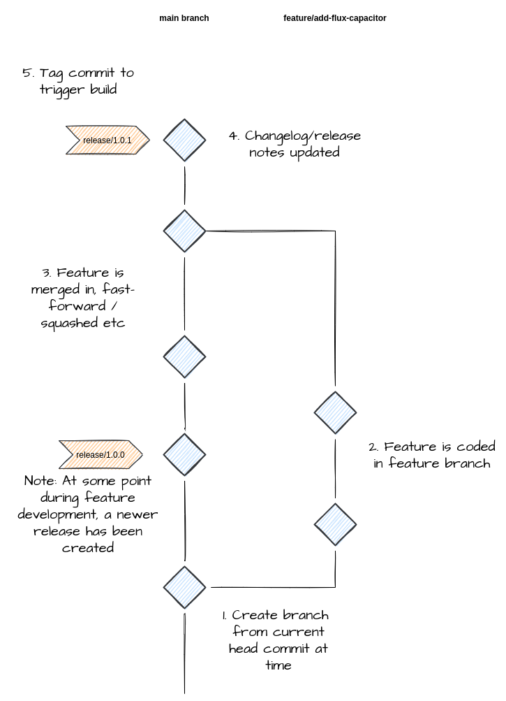
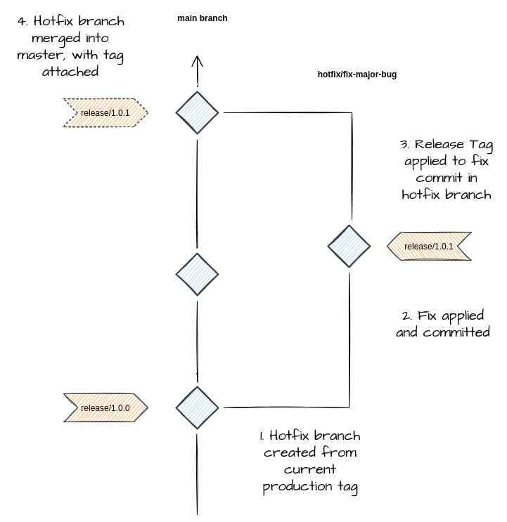
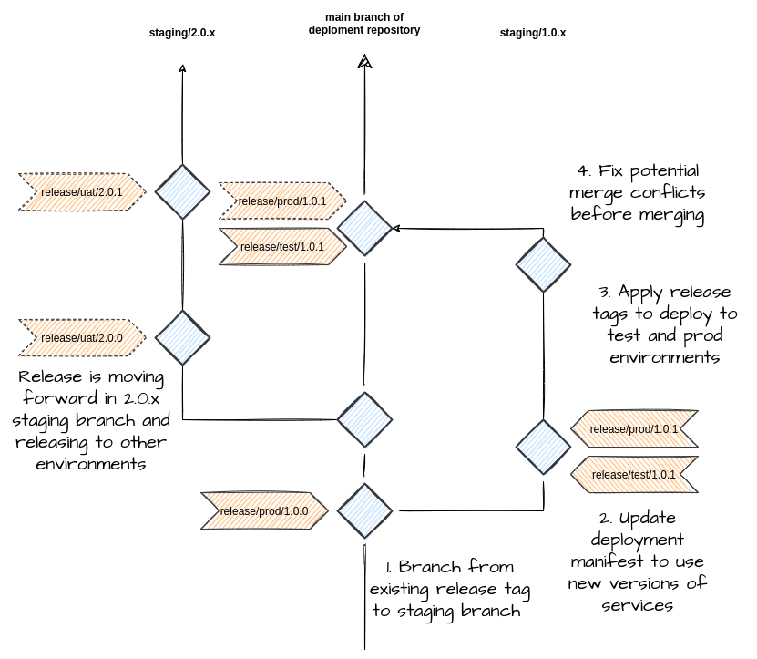
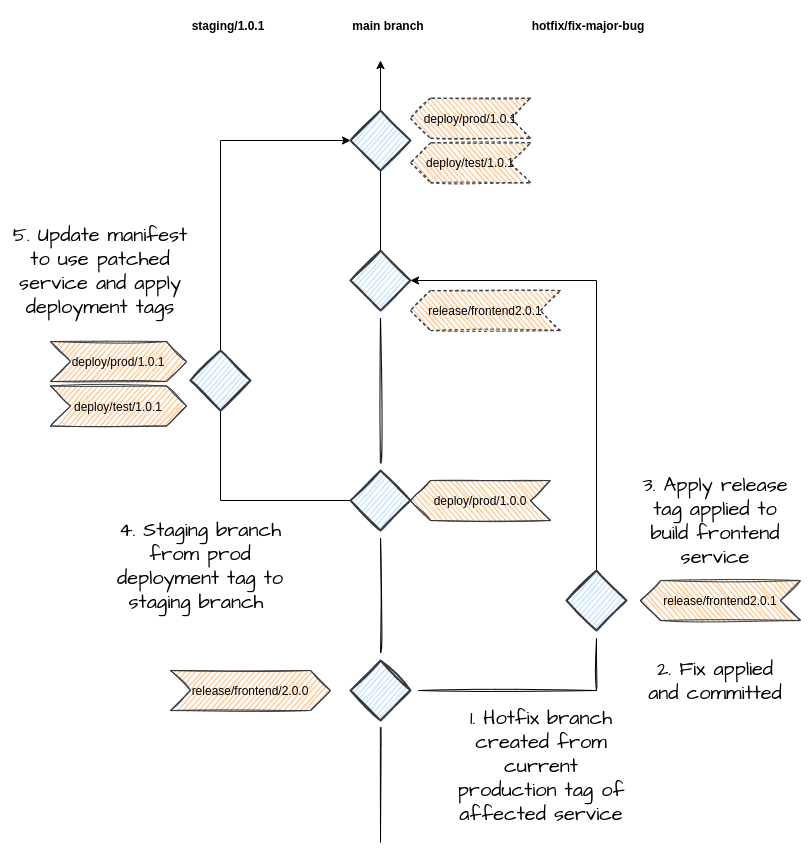

# Git Tag Flow (GTF) Version 0.0.7


Git Tag Flow is an alternate, convention based workflow to gitflow and trunk
based work flows. It combines the best (lightest) features of both, and provides
and opinionated, yet simple, deployment and release strategy via git tags and
the principle of GitOps.


## Why another git work flow?

Git flow is heavy and even considered legacy by
[some](https://www.atlassian.com/git/tutorials/comparing-workflows/gitflow-workflow).
Heavy in that it requires maintenance of long lived branches and requires strict
conventions when performing releases via release branches.

Trunk based develops suggests that your architecture should change in order to
facilitate being able to deploy potentially "broken" functionality into
production.

GTF takes the simplicity of trunk and applies *some* of the wisdom from gitflow,
enabling GitOps via tags and enabling traceability of actions back to atomic
commits. The principle is simple: you should always be able to trace back
exactly what you deployed to production, within your git repository. This is not
only common sense, but makes replicating production issues locally a less
painful process.

## When should I use git tag flow?

GTF is ideal for microservices, or solutions where the artefacts produced are
1-1 with the repositories. For example, if you maintain several repositories
that each build a single docker image and maintain a deployment via another git
repository, say via a `docker-compose.yml` file, then git-tag-flow is ideal.

GTF is not limited to container solutions of course.

Consider a classic web application with a REST-full backend, a Single Page
Application (SPA) and infrastructure-as-code (IAC) definition that deploys to a
cloud environment, each hosted in their own Git repository. Using git-tag-flow,
the backend and front-end repositories will both produce their own distinct
artefacts, the infrastructure-as-code deployment will deploy the vetted and
versioned artefacts to the target estate.

It can also work with mono-repos, however it comes with some caveats which are
likely already accepted regardless of workflow.

## Conventions

### Branches

Single main (trunk) line of development. This is the only permanent branch, and
should have controlled access.

short-lived branches that are used for working on various code types. These are
left up to the discretion of the user, but some typical examples would be

 - `feature/some-feature`
 - `bugfix/JIRA-1234`
 - `chore/update-changelog`
 - `thys/perhapsthisworks`

For deployment repositories, an extra shortlived branch is required that is used
to deploy your solution from, typically this is called `staging/`

### Tags

Tags are used to trigger events within git-tag-flow. But it is up to you to
decide what actions are performed when a tag is pushed to a repository.

**Note** *Because of this requirement, a CICD solution is required that can be
triggered from git tags*

By convention, the base tag recommended is `release/`, this allows your build
pipeline to be able to detect tags and allows you to use whatever follows the
`release/` stubb to control the flow of build events.

For example, given a frontend SPA application. Tagging the main branch with
`release/1.0.0` might cause your build pipeline to create a zip file artefact
called `spa-1.0.0.zip` or perhaps build and push a docker image called
`spa:1.0.0` - it is up to you on how to react to these events. Some command
scenarios are listed below.

For a deployment repository, things often get slightly more complicated due to
the nature of maintaining multiple environments eg dev, test, qa & prod. A
simple solution to this problem is to extend the tag to include an environment.

For example, `release/dev/1.0.0` placed on the deployment repository would cause
your build pipeline to deploy version `1.0.0` to the `dev` environment, assuming
your pipeline is able to parse the tag values. This deployment repository also
assumes that a manifest exists that defines the correct version of the SPA and
backend components, like a `docker-compose.yml` file or VM cloud init script.

You can of course tailor the tag to contain whatever information you require, 
if this basic structure doesn't fit your needs. It's entirely up to you, as 
long as you can parse the structure and use it. Keep in mind that the purpose 
of a git tag, especially a `release/` tag in GTF is mark when an event happen, 
so that you can trace a deployment back to your source code. Putting more than
just 'facts' like environments etc in there, might make this traceability less
deterministic.

### Deployment and Service repositories

In a multi-repository setup, your typical setup might be a single git repository 
per service, which produces a single artefact, be that a docker image or other.

Multiple of these services would exist within a given solution and the combination
of them communicating comprises what makes up a deployment. 

Typically a single git repository exists that defines what versions of what 
services define a given release. In this document it is referred to as a 
*deployment manifest* but you can think of it as a simple `docker-compose.yml`
, when using GTF with docker services. Of course it could also be much 
more complicated, depending on your release process. 

### Restrictions on Tag placement

Tags should always trigger a pipeline, regardless of where they are placed
within version control. The reason for this is that managing multiple releases
is a very real thing and the reason the deployment repository specifies a
`staging/` branch convention.

When managing multiple `staging/` branches, release tags can be placed on any
commit and *ideally* a deployment will occur. When managing a single release,
then the release tag can be placed on the main branch with the same effect. It
is however, good practice to place all releases within a `staging/` branch so
that pull requests (and pull request specific pipelines) can occur.

You might ask, "Why is `staging/` the defacto name for a what is essentially a
release branch". The answer is that naming a branch the same as a tag
can cause confusion. For example, `git checkout release/1.0.0`: are we
checking out a tag or branch here? For this reason `staging/` is the branch
name that is used to trigger a release, when the `release/` tag is applied.

## Interaction with changelogs

git-tag-flow doesn't believe in automatic generation of changelogs. Automatic
generation of changelogs is not a deterministic action and changelogs **should**
be managed by the developer, and treated as a change to the code base in which
it lives.

That being said, there is nothing to stop you generating a changelog during a
build event.

## Scenarios 

The following are scenarios that explain the typical actions that happen within
a development lifecyle, when using tag flow. Within all the examples, it is 
assumed that a pipeline is present that is capable of triggering an action
based on the presence of a tagged commit. 

### Feature Flow

The most basic and day to day flow does not differ from any other workflow.
A developer or set of developers work in a seperate branch, say a `feature/` 
branch that has been forked from the main branch at some point. 

Where GTF comes into play is that users can, if they require, release their
code and trigger a build of their service artefact by applying a `release/`
tag. 

This is not the normal behaviour, and usually reserved for hot fix events,
or similar. However it *is* possible.

The standard behaviour would be, developer codes feature in feature branch,
then applies whatever merge strategy to merge into the master branch. Once
a release is required/ready, then the main branch can be tagged with say
`release/1.0.0` to trigger a build of that service. This service artefact
can then be referenced within a deployment manifest.



**note** for purists, who don't want to mess with the main branch, a 
temporary branch can be created to prep the release, apply the tag and 
merge into master. This is the way, if you have main branch permissions 
that don't allow direct interaction via a user.

### Deploying to environment via tag

For reference, this particular build pipeline extract is for Azure Devops
pipelines.

```yaml
variables:
  - name: isMain
    value: $[eq(variables['Build.SourceBranch'], 'refs/heads/master')]
  - name: isReleaseTag
    value: $[startsWith(variables['Build.SourceBranch'], 'refs/tags/release/')]

trigger:
  tags:
    include:
      - release/*

steps:
  - script: |
        # removes the refs/tags/
        export GIT_TAG=${BUILD_SOURCEBRANCH:10} 
        export ENVIRONMENT=$(echo ${GIT_TAG} | cut --delimiter=/ -f2)
        export RELEASE_VERSION=$(echo ${GIT_TAG} | cut --delimiter=/ -f3)
        export DOCKER_REGISTRY_PASSWORD
        export DOCKER_REGISTRY_USERNAME
        export DOCKER_REGISTRY_FQDN
        make -e deploy
    env:
      DOCKER_REGISTRY_PASSWORD: $(REGISTRY_PASSWORD)
      DOCKER_REGISTRY_USERNAME: $(REGISTRY_USERNAME)
      DOCKER_REGISTRY_FQDN: $(REGISTRY_FQDN)
    displayName: Deploy...
    condition: eq(variables.isReleaseTag, true)
```

### Hot Fix

Say the current production deploy is 1.0.0. We have a multi repo solution,
and the manifest looks similar to the following.

```yml
version: 1.0.0
deploy:
    frontend:
        version: 2.0.0
        
    backend:
        version: 2.1.0
```

In this scenario the frontend service requires a hotfix to the production
deployment.

A developer working on the frontend will create a branch from `release/2.0.0` 
to `hotfix/fix-urgent-bug`

Apply the fix and commit. Assuming testing is all good, then the new release
for the frontend service can be triggered directly from the this branch by applying
the tag, `release/2.0.1`, creating the new service artefact in the process.

Now, in the deployment repository, we branch from the current prod release 
tag `release/prod/1.0.0` into a branch called `staging/1.0.1`. *Notice 
the staging branch doesn't have an environment indicated, that's because with
GTF any staging branch can potentially release to any environment - as long 
as your pipline is setup that way*.

The deployment manfiest is updated to reflect the bump in the frontend service,
2.0.1 and production version bump.

```yml
version: 1.0.1
deploy:
    frontend:
        version: 2.0.1

    backend:
         version: 2.1.0
```

The commit is then tagged to be deployed to production via, `release/prod/1.0.1`
which triggers a production deployment with the new service.
    
The staging branch`staging/1.0.1`, is then merged back into main branch.




### Managing multiple releases

There's no easy way to manage multiple releases without at least a little bit 
of pain. When you have 2 or more active releases, all in various states of being 
deployed to an environment, at some point all of the `staging/` branches will 
need to be merged into the main branch. This process is straight forward if 
your release versioning is linear, but what if they aren't? At when it comes 
time to merge, you might lose the history of the deployment manifest.

Within a multi repo solution, say the current production deploy is 1.0.0 and 
the team is busy with a UAT cycle for an upcoming 2.0.0 release. 

Consider a deployment manifest for the existing production deploy, version 1.0.0 
that looks like this.

```yml
version: 1.0.0
deploy:
    frontend:
        version: 2.0.0
        
    backend:
        version: 2.1.0
```

For simplicities sake, the development team has been busy pushing ahead with 
a major release, and has bumped all the service versions up by a major version.

```yml
version: 2.0.0
deploy:
    frontend:
        version: 3.0.0
        
    backend:
        version: 3.0.0
```

A production bug is found within the version 1.0.0 release, which needs to be
addressed. It's a significant bug, so will require some quick testing in a lower
environment before being deployed to production.

Within the frontend service repository, a developer has created a fix and 
applied tag `release/2.0.1`, creating a new 2.0.1 version artefact in the process.

In the deployment repository, a branch is created from the `release/prod/1.0.0` 
tag, called `staging/1.0.x`. 

**Note:** The `x` is used in this case just to be clear that
this branch could potentially release any patch level release. There is no reason
not to lock it down to `staging/1.0.1`, but sometimes there can be multiple
iterations before the bug is truely squashed.

The developer updates the manifest to use the new version of the frontend - 2.0.1.

```yml
version: 1.0.1
deploy:
    frontend:
        version: 2.0.1
        
    backend:
        version: 2.1.0
```

Once this and any other changes like changelogs are updated, then the change is 
committed and tagged for release to a test environment, `release/test/1.0.1`

Once the testing is approved, the same commit is tagged for release to production,
`release/prod/1.0.1` and merged.

Meanwhile, the other developers have been busy developing the next version of the 
production (v2.0.0) and have deployed to the uat environment several times.




The rule of thumb when managing multiple releases is that once a release is deployed
to the highest environment, production. It should be merged to the main branch.

### Container builds with latest and fixed version tags

Example of a general purpose build pipeline that can create a `latest` docker
image or fix version depending on the build condition. For reference, this
particular build pipeline extract is from Azure DevOps.

```yaml

variables:
  - name: isMain
    value: $[eq(variables['Build.SourceBranch'], 'refs/heads/master')]
  - name: isReleaseTag
    value: $[startsWith(variables['Build.SourceBranch'], 'refs/tags/release/')]

trigger:
  tags:
    include:
      - release/*

steps:
  - script: |
        export DOCKER_IMAGE_TAG=latest
        export DOCKER_REGISTRY_PASSWORD
        export DOCKER_REGISTRY_USERNAME
        export DOCKER_REGISTRY_FQDN
        make -e docker-build
        make -e docker-push
    displayName: Build and Push Latest Image
    condition: or(eq(variables.isMain, true), eq(variables.isReleaseTag, true))
    env:
      DOCKER_REGISTRY_FQDN: $(REGISTRY_FQDN)
      DOCKER_REGISTRY_PASSWORD: $(REGISTRY_PASSWORD)
      DOCKER_REGISTRY_USERNAME: $(REGISTRY_USERNAME)


  - script: |
        # 18 characters == refs/tags/release/
        export DOCKER_IMAGE_TAG=${BUILD_SOURCEBRANCH:18}
        export DOCKER_REGISTRY_PASSWORD
        export DOCKER_REGISTRY_USERNAME
        export DOCKER_REGISTRY_FQDN
        make -e docker-build
        make -e docker-push
    env:
      DOCKER_REGISTRY_PASSWORD: $(REGISTRY_PASSWORD)
      DOCKER_REGISTRY_USERNAME: $(REGISTRY_USERNAME)
      DOCKER_REGISTRY_FQDN: $(REGISTRY_FQDN)
    displayName: Build and Push Release Image
    condition: eq(variables.isReleaseTag, true)
```

### Generate pdf for every release

In this scenario every `release/` tag triggers the generation of pdf version of
the project's README.md. We use github actions here as this is where the GTF
repo is currently hosted.

```yaml
name: Make pdf for every release
on:
  push:
    tags:
      - release/*
jobs:
  convert_to_pdf:
    runs-on: ubuntu-20.04
    steps:
      - name: Check out markdown
        uses: actions/checkout@v2
      - name: Create files list
        id: files_list
        run: |
          mkdir output
          echo "::set-output name=files::README.md"
      - name: Get release version
        id: release_version
        run: |
          echo "::set-output name=release_version::$(echo ${{ github.ref }} | cut --delimiter=/ -f4)"
      - name: Convert to pdf
        uses: docker://pandoc/latex:2.14.2
        with:
          args: >- 
            --output=output/gtf-${{ steps.release_version.outputs.release_version }}.pdf
            ${{ steps.files_list.outputs.files }}
      - uses: actions/upload-artifact@v2.2.4
        with:
          name: gtf-${{ steps.release_version.outputs.release_version }}.pdf
          path: output/gtf-${{ steps.release_version.outputs.release_version }}.pdf

```


### Mono-Repos

Git-Tag-Flow can work with mono-repos, however there are reasons why a mono repo
might not always be [a](https://fossa.com/blog/pros-cons-using-monorepos/)
[good](https://alexey-soshin.medium.com/monorepo-is-a-bad-idea-5e587e848a07)
[choice](https://semaphoreci.com/blog/what-is-monorepo).

This is just an example to mimic the multi-repository setup as much as possible. 
There could be any number of ways to achieve the same outcome.

Consider the following monorepo structure. It contains the services `frontend`
and `backend`, a `deploy` folder containing something that represents a 
deployment manifest. 

```shell
backend/
deploy/
frontend/
.git
.gitignore
README.md
```

With a multi-repo structure, each of the services would be within their own 
repository, so releasing a new build of the service is a matter of applying 
a simple tag like `release/1.0.0`. In the monorepo world, we can't apply this 
without assuming that all services are to be released at the same time, with
the same version number. 

To move around this limitation, introduce an extra segment into the `release`
tag structure to differentiate. Following on from the above example, to 
release a new version of the frontend service, you would apply the tag
`release/frontend/1.0.0`. Similarly for the backend service. 

Your pipeline that reacts to this tag being applied obviously needs to be 
able to build accordingly, based on what service has been requested in the 
tag. This shouldn't be a problem, since this is exactly what is required 
when performing a deployment - at least in the multi-repo scenario.

Note how in this examplem the service in this case matches the service 
folder name, this would make it very easy to create a generic pipeline 
that builds any service within a matched direction.

So we can now build our services within the mono-repo independently, however
we now have a problem when we want to release. Traditionally with GTF, 
we would tag the deployment repository with a tag like `release/prod/1.0.0` 
to indicate that we want to deploy the specific versions of the services
to production. This tag structure, unfortunately, conflicts with the 
*new* structure for releasing an artefact of a given service, so we need to 
adapt.

There's a few ways we could do this, we could naively adjust our pipeline 
to only look for pre-canned service folders specified within the `release/`
tag, but this wouldn't scale as we'd have to constantly update the pipeline 
as you add new services. You could simply change your pipeline to react 
differently if the "deploy" folder is detected within the `release/` tag,
ie `release/deploy/1.0.0`. This would work well, but could look confusing
when looking through git history.
Finally you could change the prefix of a deployment specific `release/` tag 
from `release/` to `deploy/` and keep the structure the same and at the 
same time be completely specific about what is a deployment and what is a 
build.

#### Monorepo hotfix scenario

Given all the above, a hotfix scenario in a mono-repo would be as follows.

Assume the current production release is the following deployment-manifest,
which is defined (somehow) within the deploy folder of the repo. Also assume
for arguments sake that the chosen tag used to deploy this release was 
`deploy/prod/1.0.0` and that the release tags to build the service artefacts
where `release/frontend/2.0.0` and `release/backendfrontend/2.1.0`. 

```yml
version: 1.0.0
deploy:
    frontend:
        version: 2.0.0
        
    backend:
        version: 2.1.0
```

A hotfix is required within the frontend service, so the developer follows
the standard procedure and branches from the `release/frontend/2.0.0` tag
into a branch called `hotfix/fix-critical-bug`. 

Like the multi-repo hotfix scenario, the fix is significant so a quick test
environment deployment is required before it can go to production. 

The developer fixes the code in the hotfix branch and commits the code. They
then apply a release tag, to build the service so that it can be deployed. 
`release/frontend/2.0.1`. 

After the build is finished and the artefact exists, the deployment can begin.

The developer creates a staging branch, forked from the existing deployment
tag, `deploy/prod/1.0.0`, calling it `staging/1.0.1`. The developer edits the 
deployment manifest to indicate the new version of the frontend service is 
required. They also bump the version of the release to `1.0.1` - indicating 
a bugfix in the semantic versioning world.

```yml
version: 1.0.1
deploy:
    frontend:
        version: 2.0.1
        
    backend:
        version: 2.1.0
```

The developer wants to deploy to test, so the tag `deploy/test/1.0.1` is
applied to the commit and pushed to trigger the deployment pipeline. After
the fix has been tested, the developer can now apply and push the production
tag, `deploy/prod/1.0.1` to the same commit.

After the deployment is complete and confirmed in production, the hotfix
branch is merged into the main branch, followed by the `staging/` branch. 
While all this is happening every other dev continues as per normal.

The following diagram illustrates the process.




It would be expected in this case that the CICD solution would create the
frontend and backend artifacts, before the deployment procedure is called. 
This might result in two artifacts, `frontend-2.0.1.zip` and `backend-2.1.0.zip`,
or similar with docker images `frontend:2.0.1` and `backend:2.1.0`. The point
is, they must exist before a deployment can occur - because a build and 
deployment are two distinct actions.

An example pipeline build in this example that  would be a deploy a set 
of artefacts when triggered after a `deploy/` tag is detected.

```yaml
variables:
  - name: isDeployTag
    value: $[startsWith(variables['Build.SourceBranch'], 'refs/tags/deploy/')]

trigger:
  tags:
    include:
      - release/*

steps:
  - script: |
        # removes the refs/tags/
        export GIT_TAG=${BUILD_SOURCEBRANCH:10} 
        export ENVIRONMENT=$(echo ${GIT_TAG} | cut --delimiter=/ -f2)
        export RELEASE_VERSION=$(echo ${GIT_TAG} | cut --delimiter=/ -f3)
        export DOCKER_REGISTRY_PASSWORD
        export DOCKER_REGISTRY_USERNAME
        export DOCKER_REGISTRY_FQDN
        make -e deploy
    env:
      DOCKER_REGISTRY_PASSWORD: $(REGISTRY_PASSWORD)
      DOCKER_REGISTRY_USERNAME: $(REGISTRY_USERNAME)
      DOCKER_REGISTRY_FQDN: $(REGISTRY_FQDN)
    displayName: Deploy...
    condition: eq(variables.isDeployTag, true)
```

This pipeline could easily be extended to provide continuous deployment to a
development server. For this, any change to the main branch could trigger a 
deployment and/or run CI tests. 


## Best Practices

###  Abstract pipeline code where possible into easier to run scripts/make targets.

This isn't specific to git-tag-flow, but a good practice is to encapsulate as
much as you can into scripts that can be run externally, not just within your pipelines.

There will be times when you need to deploy manually, you don't want to be trying 
to recreate your pipeline logic in your developer environment in a pressure situation. 

Another good reason to apply this logic, is that pipelines come and go, as does git
hosting. Not being locked into a particular vendor can be a good thing.

###  Alternatives to the default, `release/` tag and `staging/` branch names

There's no firm rules around the tag and branching names for feature, bugfix, hotfix and
chore ephemeral branches. That is left completely up to the developer. The only 
suggested branches and tag names are the `release/` tag and `staging/` branch. 

Some alternatives are to the above are `deploy/` tag and `release/` branch, it is 
entirely up to you and what makes sense for your situation. However you should ask
yourself, does the verb and noun makes sense when it is applied to the tag and branch?

This is especially true when using GTF with mono-repos.

### Embrace Fast Forward merge commits

When using `staging/` branches within your deployment repository, if you apply multiple
`release/` tags within that branch, then rebasing and squashing becomes hard, because
you would lose the commits that those tags are attached to. For this reason, embrace
merge commits and keep all that history.

The same can't be said for your service repositories. If you aren't triggering builds 
from your feature/bugfix/hotfix branches, then there is no reason why you can't keep
your commit history lean-and-mean. Rebase and squash is your friend here.
